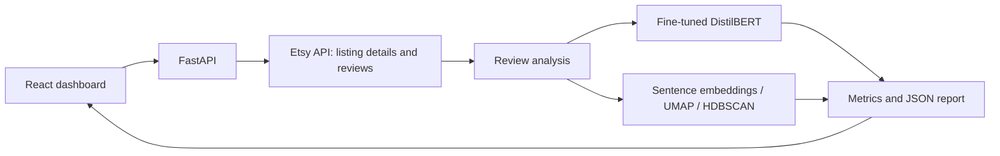

# Etsy Review Intelligence

**Turn customer reviews into sentiment insights, recurring product themes, and listing comparisons.**

An end-to-end NLP portfolio project combining transformer fine-tuning, unsupervised topic discovery, a FastAPI backend, and a React dashboard. Users enter one to ten Etsy listing IDs or URLs to explore customer feedback and compare products.

## Project at a glance

| Area | Implementation |
| --- | --- |
| Problem | Star ratings alone do not explain what customers like or what needs improvement. |
| Sentiment | DistilBERT adapted to Amazon Electronics reviews, then used to score Etsy review text. |
| Topics | Sentence embeddings, UMAP, and HDBSCAN identify recurring themes without predefined topic labels. |
| Application | Etsy API ingestion, interactive charts, saved JSON reports, and multi-listing rankings. |
| Recorded result | Evaluation accuracy increased from **83.75% to 93.75%** on 400 Amazon reviews. |

The evaluation split also guided checkpoint selection; these results are development metrics, not an independent final test or an Etsy benchmark. See [model evaluation](#model-evaluation).

**Explore the work:** [Training notebook](notebooks/fine_tune_distilbert_amazon_reviews.ipynb) · [NLP pipeline](backend/sentiment_analysis.py) · [API](backend/app.py) · [Dashboard](frontend/src/main.jsx)

## What the application does

- **Collect reviews:** fetch listing details and paginate through reviews exposed by the Etsy API, with retries for transient failures.
- **Analyze sentiment:** score review text, summarize positive/negative/neutral feedback, and flag disagreements between text and star ratings.
- **Discover topics:** group related review sentences, extract descriptive phrases, and surface representative feedback and topic sentiment.
- **Explore results:** display sentiment trends, topic risks, rating-versus-sentiment charts, and a 2D topic map.
- **Compare listings:** rank products using a configurable-in-code heuristic combining sentiment (60%) and star rating (40%).
- **Reuse analysis:** save reports locally and cache up to eight analysis results in memory for identical review payloads and analysis versions.

## How it works



The backend fetches current reviews before checking the analysis cache. Single-listing requests return a detailed report; multi-listing requests return individual analyses, a ranking, and any listing-level failures. Reports are stored in `data/` and can be reopened from the dashboard.

| Layer | Technologies |
| --- | --- |
| Backend | Python, FastAPI, Uvicorn, Requests |
| Frontend | React, Vite, Lucide React, CSS |
| Sentiment | PyTorch, Hugging Face Transformers, DistilBERT |
| Topic discovery | Sentence-Transformers, UMAP, HDBSCAN, scikit-learn, NLTK |
| Experiments | Hugging Face Datasets/Trainer, pandas, Matplotlib, Seaborn |
| Packaging | Docker with a frontend build stage and Python runtime |

## Model evaluation

The [notebook](notebooks/fine_tune_distilbert_amazon_reviews.ipynb) includes training code, recorded outputs, a model comparison, and a confusion matrix.

- **Starting model:** `distilbert-base-uncased-finetuned-sst-2-english`.
- **Dataset:** `contemmcm/amazon_reviews_2013`, `electronics` configuration. The stream is read until 1,000 examples per class are collected.
- **Labels:** 1–2 stars → negative; 4–5 stars → positive; 3-star reviews excluded.
- **Split:** 1,600 training and 400 evaluation examples, stratified with seed 42.
- **Training:** three epochs, learning rate `2e-5`, maximum length 256 tokens, training batch size 16; best checkpoint selected by positive-class F1.

| Model | Accuracy | Positive-class F1 |
| --- | ---: | ---: |
| Base SST-2 model | 83.75% | 82.09% |
| Amazon-adapted model | **93.75%** | **93.61%** |

This is a **10.00 percentage-point accuracy improvement** and an **11.52 percentage-point F1 improvement** on the same evaluation examples. The fine-tuned model's separately reported macro F1 is 93.7%.

**Evaluation scope:** the notebook calls this split `test`, but uses it for evaluation after each epoch and best-checkpoint selection. A separate untouched test set is needed for a final generalization estimate. These recorded results have not been established on labeled Etsy reviews.

## Run locally

Run commands from the repository root unless stated otherwise. Use **Python 3.11** for the existing dependency set and **Node.js 22.12+** for the frontend. Live analysis requires Etsy credentials, the trained sentiment model, and internet access for review collection and initial embedding-model downloads.

### 1. Install Python dependencies

Windows PowerShell:

```powershell
py -3.11 -m venv .venv
.\.venv\Scripts\Activate.ps1
python -m pip install -r requirements.txt
python -m nltk.downloader stopwords
```

macOS / Linux:

```bash
python3.11 -m venv .venv
source .venv/bin/activate
python -m pip install -r requirements.txt
python -m nltk.downloader stopwords
```

Create a `.env` file in the repository root (or edit your existing one):

```env
ETSY_API_KEY=your_etsy_keystring
ETSY_API_SECRET=your_etsy_shared_secret
ETSY_API_BASE_URL=https://openapi.etsy.com/v3
```

Replace the placeholders with your credentials. The base URL matches the backend default. Credentials and generated reports are excluded from Git.

### 2. Prepare the sentiment model

Trained weights are **not included in Git**. Restore an existing exported model to `models/distilbert-amazon-reviews/final/`, or run the training notebook:

```bash
python -m pip install jupyterlab
python -m jupyterlab notebooks/fine_tune_distilbert_amazon_reviews.ipynb
```

Select the project environment as the notebook kernel and run all cells. The notebook saves the model and tokenizer to the location expected by the backend. Training downloads the source dataset and base model and may take time on CPU.

### 3. Build the dashboard and start the app

```bash
cd frontend
npm ci
npm run build
cd ..
python -m uvicorn backend.app:app --host 127.0.0.1 --port 8000
```

Open **http://localhost:8000**. Enter one to ten real Etsy listing IDs or URLs, separated by commas or newlines. Interactive API documentation is available at **http://localhost:8000/docs**.

For frontend development, run `python -m uvicorn backend.app:app --reload` in one terminal and `npm run dev` from `frontend/` in another. Open **http://localhost:5173**; Vite proxies `/api` requests to port 8000.

## API and tests

| Method | Endpoint | Purpose |
| --- | --- | --- |
| `GET` | `/api/health` | Service liveness; does not validate credentials or model availability |
| `POST` | `/api/analyze` | Analyze 1–10 listing IDs or URLs |
| `GET` | `/api/reports` | List saved report filenames |
| `GET` | `/api/reports/{filename}` | Load a report and refresh outdated analysis when needed |

Example request body for `/api/analyze` (replace the illustrative ID with a real listing):

```json
{
  "listing_ids": ["1234567890"]
}
```

Run the existing regression tests from the repository root:

```bash
python -m unittest discover -s tests -v
```

Tests cover cache reuse, invalidation, bounded capacity, annotation isolation, and saved-report repair. They mock expensive analysis and do not require Etsy credentials or model inference.

## Repository layout

```text
backend/                  FastAPI routes, Etsy client, NLP pipeline, cache
frontend/                 React dashboard and Vite configuration
notebooks/                Fine-tuning experiment with recorded results
tests/                    Backend regression tests
docs/deployment.md        Docker instructions and operational notes
models/                   Local model exports and checkpoints (ignored)
data/                     Generated JSON reports (ignored)
.env                      Local credentials (ignored; create during setup)
requirements.txt          Python dependencies
Dockerfile                Frontend build and API runtime
```
